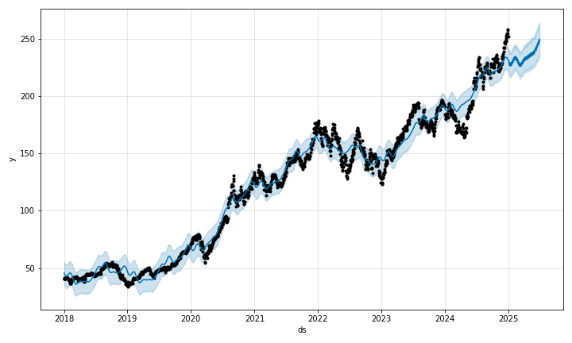

# 📈 Stock Price Forecasting with Prophet

This project forecasts stock prices using **Facebook Prophet**, a powerful time series forecasting tool. We use `yfinance` to fetch historical stock data and predict future trends.

## 🔧 Technologies Used

- Python
- [yfinance](https://pypi.org/project/yfinance/)
- [Prophet](https://facebook.github.io/prophet/)
- Jupyter Notebook
- Matplotlib
- Pandas

## 📁 Files Included

| File Name              | Description                          |
|------------------------|--------------------------------------|
| `stock_forecast.ipynb` | Main notebook (data load + forecast) |
| `forecast_plot.png`    | Forecasted stock price plot image    |
| `README.md`            | Project overview and instructions    |

## 📊 Forecast Plot



## ▶️ How to Run It Locally

1. 📥 **Install required packages:**

```bash
pip install yfinance prophet matplotlib pandas

2. ## 🚀 Launch Jupyter Notebook:

```bash
jupyter notebook

📂 Open stock_forecast.ipynb and run all cells

📸 Plot will be saved as forecast_plot.png
